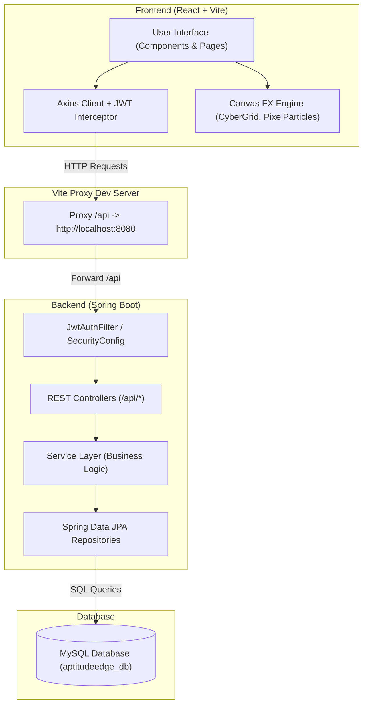

# 🚀 AptiQuest (AptitudeEdge)

> **Next-Generation Gamified Aptitude & Exam Preparation Platform**

AptiQuest (also known as AptitudeEdge) is a full-stack, enterprise-grade web application built for students, job aspirants, and competitive exam test-takers. It combines a robust Spring Boot backend with a highly responsive React frontend featuring dark futuristic cyberpunk visuals, interactive canvas particle animations, timed test arenas, detailed solution breakdowns, formula sheets, personal question bookmarking, gamified leaderboards, and an administrative control suite.

---


---

## 📋 Table of Contents

- [Overview](#-overview)
- [Key Features](#-key-features)
- [Tech Stack](#-tech-stack)
- [System Architecture](#-system-architecture)
- [Project Directory Structure](#-project-directory-structure)
- [API Endpoints Reference](#-api-endpoints-reference)
- [Database Schema & Models](#-database-schema--models)
- [Getting Started & Setup Guide](#-getting-started--setup-guide)
  - [Prerequisites](#prerequisites)
  - [1. Clone Repository](#1-clone-repository)
  - [2. Database Setup](#2-database-setup)
  - [3. Backend Setup](#3-backend-setup)
  - [4. Frontend Setup](#4-frontend-setup)
- [Environment Variables & Configuration](#-environment-variables--configuration)
- [Troubleshooting & FAQs](#-troubleshooting--faqs)
- [Contributing](#-contributing)
- [License](#-license)

---

## 🌟 Overview

AptiQuest addresses the traditional monotony of aptitude preparation by transforming practice into an interactive, gamified, and aesthetically captivating experience. Users can practice quantitative, logical, and verbal aptitude questions, take timed mock tests, view detailed performance analytics, review essential mathematical formulas, bookmark difficult questions, and track their standing on a global leaderboard.

---

## ✨ Key Features

### 🔐 1. Authentication & Security
- **Dual-Token System**: JWT Access Tokens paired with HttpOnly Refresh Tokens for seamless, secure user sessions.
- **Automated Token Rotation**: Axios response interceptors handle transparent access token renewal without user interruption.
- **Role-Based Access Control (RBAC)**: Enforces distinct authorization levels (`ROLE_USER`, `ROLE_ADMIN`).

### 📚 2. Question Bank & Practice Portal
- **Category & Difficulty Filtering**: Practice across Quantitative Aptitude, Logical Reasoning, and Verbal Ability, filtered by Easy, Medium, or Hard difficulty.
- **Instant Answer Validation**: Real-time feedback with step-by-step explanations for each question.
- **Search & Pagination**: Dynamic searching across question content and categories.

### ⏱️ 3. Mock Test Center & Test Arena
- **Timed Mock Tests**: Real-time countdown timer, question palette for navigation (answered, flagged, unvisited).
- **Automated Scoring**: Automated evaluation upon submission or time expiry.
- **Detailed Result Breakdown**: Instant post-test analysis showing score, accuracy %, correct/incorrect response log, and step-by-step solutions.

### 🏆 4. Gamified Leaderboard
- **Global Rankings**: Compete with other users based on cumulative test performance, accuracy, and questions solved.
- **Top Performer Badges**: Dynamic rank badges highlighting top test-takers.

### 📖 5. Formula Sheet & Revision Cheatsheets
- **Topic-Wise Formulas**: Quick access to essential math formulas, shortcut tricks, and core concepts.
- **Category Indexing**: Seamless tab navigation across Speed & Distance, Algebra, Geometry, Data Interpretation, and more.

### 🔖 6. Bookmarking & Revision System
- **Saved Questions**: Bookmark challenging questions for later review during practice sessions.
- **Personalized Notes**: Manage saved bookmarks directly from a dedicated Bookmarks management page.

### ⚙️ 7. Comprehensive Admin Dashboard
- **Question Management**: Full CRUD capabilities to create, edit, view, and delete questions.
- **Custom Test Creator**: Assemble custom tests by selecting specific questions, setting time limits, and publishing to the Test Center.
- **Platform Analytics**: High-level statistics on total registered users, question volume, active tests, and submission counts.

### 🎨 8. Cyberpunk & Futuristic Aesthetic
- **Canvas Visual FX**: Custom HTML5 Canvas components (`CyberGrid`, `PixelParticles`, `VoxelRobot`) creating an interactive background ambiance.
- **Tailwind CSS Styling**: Custom glow effects, neon highlights, dark-mode color palettes, and smooth UI micro-animations.

---

## 🛠️ Tech Stack

### Frontend Framework & Libraries
- **Core**: React 18.3, Vite 5.4, JavaScript (ES6+)
- **Styling**: Tailwind CSS 3.4, PostCSS, Autoprefixer
- **Routing**: React Router DOM 6.18
- **HTTP Client**: Axios 1.5 with custom Auth Request/Response Interceptors
- **Icons & FX**: Lucide-React / Custom HTML5 Canvas FX Engine

### Backend Framework & Libraries
- **Framework**: Spring Boot 3.5.x (Java 17)
- **Security**: Spring Security 6.x, JJWT (io.jsonwebtoken 0.11.5)
- **Data Persistence**: Spring Data JPA / Hibernate
- **Database Driver**: MySQL Connector/J
- **Utilities**: Lombok, Spring Boot Validation, Spring Boot DevTools

---

## 🏗️ System Architecture



---

## 📁 Project Directory Structure

```text
aptitudeedge/
├── aptitudeedge-backend/                  # Spring Boot Java Backend
│   ├── src/
│   │   ├── main/
│   │   │   ├── java/com/aptitudeedge/
│   │   │   │   ├── controller/            # REST Endpoints (Auth, Question, Test, etc.)
│   │   │   │   ├── dto/                   # Request & Response DTO Objects
│   │   │   │   ├── exception/             # Global Exception Handler & API Error Payloads
│   │   │   │   ├── model/                 # JPA Entity Models (User, Question, Test, etc.)
│   │   │   │   ├── repository/            # Spring Data JPA Repositories
│   │   │   │   ├── security/              # JWT Utilities, Auth Filter, SecurityConfig
│   │   │   │   └── service/               # Core Business Logic Services
│   │   │   └── resources/
│   │   │       ├── application.properties # Application Configuration
│   │   │       └── data.sql               # Seed Data Script
│   └── pom.xml                            # Maven Build Dependencies
│
├── aptitudeedge-frontend/                 # React 18 + Vite Frontend
│   ├── public/                            # Static Web Assets
│   ├── src/
│   │   ├── components/                    # UI Views & Canvas Components
│   │   │   ├── AdminDashboard.jsx         # Question & Test Administration
│   │   │   ├── AuthPage.jsx               # Login & Registration Forms
│   │   │   ├── BookmarkPage.jsx           # Saved Questions Management
│   │   │   ├── CyberGrid.jsx              # Canvas Grid FX
│   │   │   ├── Dashboard.jsx              # User Central Hub
│   │   │   ├── FormulasPage.jsx           # Aptitude Formula Reference
│   │   │   ├── LandingPage.jsx            # Platform Landing Page
│   │   │   ├── LeaderboardPage.jsx        # Global Leaderboard View
│   │   │   ├── PixelParticles.jsx         # Interactive Canvas Particles FX
│   │   │   ├── QuestionsPage.jsx          # Practice Question Bank
│   │   │   ├── TestArenaPage.jsx          # Timed Test Interface
│   │   │   ├── TestCenterPage.jsx         # Available Mock Tests List
│   │   │   ├── TestResultPage.jsx         # Post-test Score & Solutions View
│   │   │   └── VoxelRobot.jsx             # Canvas 3D Voxel Mascot FX
│   │   ├── api.js                         # Axios Instance with JWT Refresh Interceptor
│   │   ├── App.jsx                        # Main Application Routes & Navigation
│   │   ├── index.css                      # Tailwind Directives & Custom Styles
│   │   └── main.jsx                       # React Application Entry Point
│   ├── package.json                       # Frontend Dependencies & Scripts
│   ├── tailwind.config.js                 # Tailwind Custom Theme Configuration
│   └── vite.config.js                     # Vite Config with /api Backend Proxy
└── README.md                              # Main Project Documentation
```

---

## 📡 API Endpoints Reference

### 🔑 Authentication (`/api/auth`)
| Method | Endpoint | Access | Description |
| :--- | :--- | :--- | :--- |
| `POST` | `/api/auth/register` | Public | Register a new user account |
| `POST` | `/api/auth/login` | Public | Authenticate user & receive JWT access token |
| `POST` | `/api/auth/refresh` | Public (Cookie) | Issue new access token using valid refresh token cookie |
| `POST` | `/api/auth/logout` | Authenticated | Revoke refresh token and clear auth cookies |
| `GET` | `/api/auth/me` | Authenticated | Fetch details of currently logged-in user |

### ❓ Question Bank (`/api/questions`)
| Method | Endpoint | Access | Description |
| :--- | :--- | :--- | :--- |
| `GET` | `/api/questions` | Public / User | Fetch all questions with optional category & difficulty filters |
| `GET` | `/api/questions/{id}` | Public / User | Fetch specific question details |
| `GET` | `/api/questions/categories` | Public / User | Fetch list of available question categories |

### 📝 Mock Tests (`/api/tests`)
| Method | Endpoint | Access | Description |
| :--- | :--- | :--- | :--- |
| `GET` | `/api/tests` | Authenticated | List all active mock tests |
| `GET` | `/api/tests/{id}` | Authenticated | Fetch test metadata and question payload |
| `POST` | `/api/tests/{id}/submit` | Authenticated | Submit completed test responses for evaluation |
| `GET` | `/api/tests/attempts/user` | Authenticated | Fetch past test attempts history for the logged-in user |
| `GET` | `/api/tests/attempts/{attemptId}` | Authenticated | Fetch specific test attempt score & breakdown |

### 🔖 Bookmarks (`/api/bookmarks`)
| Method | Endpoint | Access | Description |
| :--- | :--- | :--- | :--- |
| `GET` | `/api/bookmarks` | Authenticated | List all bookmarked questions for user |
| `POST` | `/api/bookmarks/{questionId}` | Authenticated | Add a question to bookmarks |
| `DELETE` | `/api/bookmarks/{questionId}` | Authenticated | Remove a question from bookmarks |

### 💡 Formulas (`/api/formulas`)
| Method | Endpoint | Access | Description |
| :--- | :--- | :--- | :--- |
| `GET` | `/api/formulas` | Public / User | Fetch list of all aptitude formulas by category |

### 🏅 Leaderboard (`/api/leaderboard`)
| Method | Endpoint | Access | Description |
| :--- | :--- | :--- | :--- |
| `GET` | `/api/leaderboard` | Public / User | Fetch top user rankings sorted by performance points |

### 🛠️ Admin Control (`/api/admin`)
| Method | Endpoint | Access | Description |
| :--- | :--- | :--- | :--- |
| `POST` | `/api/admin/questions` | Admin Only | Create a new question entry |
| `PUT` | `/api/admin/questions/{id}` | Admin Only | Update an existing question |
| `DELETE` | `/api/admin/questions/{id}` | Admin Only | Delete a question entry |
| `POST` | `/api/admin/tests` | Admin Only | Create a new mock test with selected questions |
| `GET` | `/api/admin/stats` | Admin Only | Retrieve system usage statistics |

---

## 🗄️ Database Schema & Models

Primary JPA entities managed by Spring Data JPA in MySQL:

- **`User`**: `id`, `username`, `email`, `password`, `role` (`ROLE_USER`/`ROLE_ADMIN`), `createdAt`.
- **`RefreshToken`**: `id`, `user_id`, `token`, `expiryDate`.
- **`Question`**: `id`, `title`, `optionA`, `optionB`, `optionC`, `optionD`, `correctOption`, `explanation`, `category`, `difficulty`.
- **`Category`**: `id`, `name`, `description`.
- **`Test`**: `id`, `title`, `description`, `durationMinutes`, `totalMarks`, `questions` (Many-to-Many with `Question`).
- **`TestAttempt`**: `id`, `user_id`, `test_id`, `score`, `totalQuestions`, `correctAnswers`, `attemptedAt`.
- **`TestAnswer`**: `id`, `test_attempt_id`, `question_id`, `selectedOption`, `isCorrect`.
- **`Bookmark`**: `id`, `user_id`, `question_id`, `createdAt`.
- **`Formula`**: `id`, `title`, `category`, `formulaText`, `description`, `example`.

---

## 🚀 Getting Started & Setup Guide

### Prerequisites

Ensure you have the following installed on your machine:
- **Java Development Kit (JDK)**: Version 17 or higher
- **Node.js**: Version 18.0.0 or higher
- **npm**: Package manager (comes with Node.js)
- **MySQL Server**: Version 8.0 or higher
- **Maven**: Version 3.8+ (or use included `mvnw` / `mvnw.cmd` wrapper)

---

### 1. Clone Repository

```bash
git clone https://github.com/Rupam797/AptiQuest.git
cd aptitudeedge
```

---

### 2. Database Setup

1. Start your local MySQL server.
2. Log into MySQL terminal or use MySQL Workbench / DBeaver:

```sql
CREATE DATABASE IF NOT EXISTS aptitudeedge_db;
```

> **Note**: Default configuration expects user `root` with password `12345`. If your MySQL configuration differs, update `application.properties` as described below.

---

### 3. Backend Setup

1. Navigate to the backend folder:
   ```bash
   cd aptitudeedge-backend
   ```
2. Check `src/main/resources/application.properties` to ensure database credentials match your environment:
   ```properties
   server.port=8080
   spring.datasource.url=jdbc:mysql://localhost:3306/aptitudeedge_db?createDatabaseIfNotExist=true&useSSL=false&allowPublicKeyRetrieval=true
   spring.datasource.username=root
   spring.datasource.password=12345
   jwt.secret=your_super_secret_key_change_this
   ```
3. Build and run the Spring Boot application:
   - **Windows (Command Prompt / PowerShell)**:
     ```cmd
     .\mvnw.cmd spring-boot:run
     ```
   - **Linux / macOS**:
     ```bash
     chmod +x mvnw
     ./mvnw spring-boot:run
     ```
4. The backend server will start on `http://localhost:8080`.

---

### 4. Frontend Setup

1. Open a new terminal window and navigate to the frontend directory:
   ```bash
   cd aptitudeedge-frontend
   ```
2. Install dependencies:
   ```bash
   npm install
   ```
3. Start the Vite development server:
   ```bash
   npm run dev
   ```
4. Open your browser and navigate to `http://localhost:3000`.

---

## ⚙️ Environment Variables & Configuration

### Backend `application.properties` Options

| Key | Default Value | Description |
| :--- | :--- | :--- |
| `server.port` | `8080` | Port for Spring Boot backend |
| `spring.datasource.url` | `jdbc:mysql://localhost:3306/aptitudeedge_db` | MySQL Connection URL |
| `spring.datasource.username` | `root` | Database username |
| `spring.datasource.password` | `12345` | Database password |
| `spring.jpa.hibernate.ddl-auto` | `update` (or `create`) | Hibernate DDL strategy |
| `jwt.secret` | `your_super_secret_key...` | HMAC-SHA secret key for JWT signing |
| `jwt.expiration` | `900000` (15 mins) | Access token expiration in ms |
| `jwt.refresh-expiration` | `604800000` (7 days) | Refresh token expiration in ms |

---

## ❓ Troubleshooting & FAQs

<details>
<summary><b>1. MySQL Connection Failed / Access Denied</b></summary>
<br />
Ensure your MySQL service is running and that the username/password in <code>application.properties</code> match your local database installation.
</details>

<details>
<summary><b>2. Frontend requests to <code>/api/*</code> return 404 or connection refused</b></summary>
<br />
Ensure the backend server is running on <code>http://localhost:8080</code> before launching the frontend. The Vite dev server proxies <code>/api</code> requests to port 8080 as configured in <code>vite.config.js</code>.
</details>

<details>
<summary><b>3. JWT Unauthorized Error on Page Refresh</b></summary>
<br />
The application uses auto-refresh via HttpOnly cookies. Ensure your browser allows cookies for <code>localhost</code> and that <code>withCredentials: true</code> is enabled in your HTTP client requests.
</details>

---

## 🤝 Contributing

Contributions are welcome! To contribute:

1. Fork the Repository.
2. Create a Feature Branch (`git checkout -b feature/AmazingFeature`).
3. Commit your Changes (`git commit -m 'Add some AmazingFeature'`).
4. Push to the Branch (`git push origin feature/AmazingFeature`).
5. Open a Pull Request.

---

## 📜 License

Distributed under the MIT License. See `LICENSE` for more information.

---

<p align="center">
  Crafted with ❤️ for Aptitude Aspirants Everywhere
</p>
